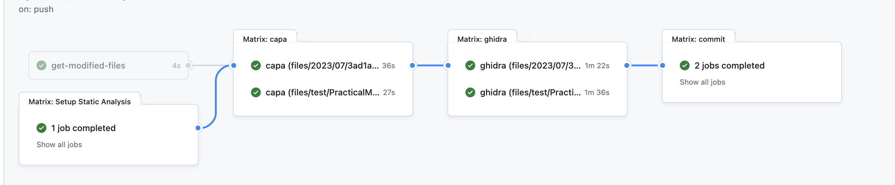
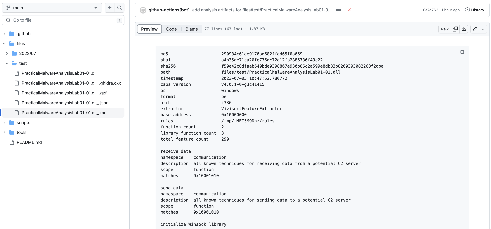
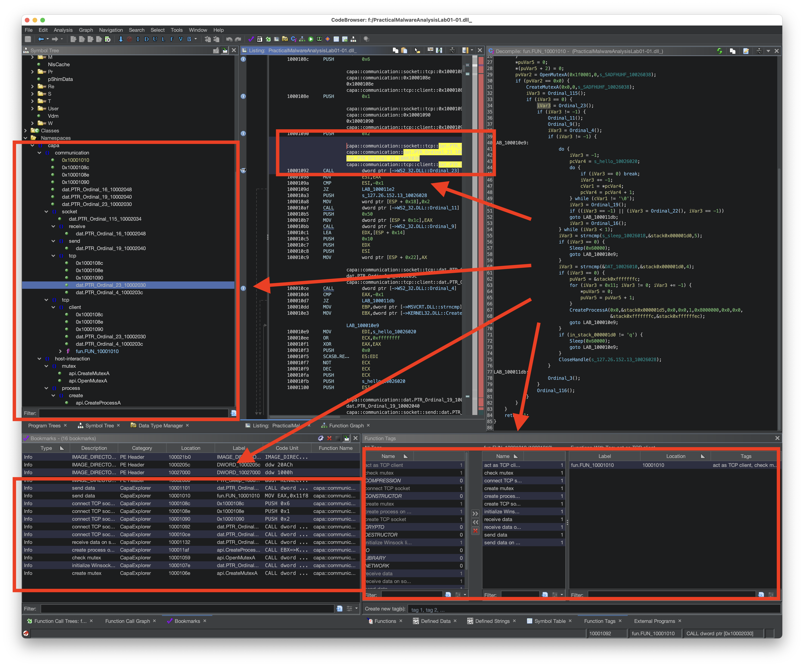

CBA
===
Continuous Binary Analysis

### Description

CBA is a GitHub Action that automatically performs binary triage on files that are pushed to a GitHub repository. 
For more details, please refer to [this blog post (Automated Rapid Binary Triage with GitHub Actions, Capa, and Ghidra)](https://rand-tech.github.io/posts/automated-rapid-binary-triage/).

## Features

- Generates artifacts from the following tools:
    - [capa](https://github.com/mandiant/capa)
      - markdown
      - json
    - [Ghidra](https://github.com/NationalSecurityAgency/ghidra)
      - decompiled code
      - gzf file (with capa results embedded)

## Usage

1. Commit the files to be analyzed under `/files`
2. Push to GitHub
3. Profit

    
    
    
